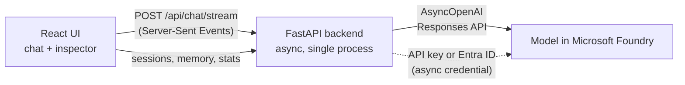

# Generative AI Chat App

A small chat application built on **Microsoft Foundry** and the **OpenAI Python SDK**, with an *inspector* panel that shows what is happening inside the chat: the context sent to the model, conversation memory, token usage, latency and live model events.

- **Backend:** Python 3.13 + FastAPI, fully async (`AsyncOpenAI`)
- **Frontend:** React + Vite + TypeScript (responsive: two panels on desktop, a Chat/Inspector switch on phones; light/dark theme; AI replies rendered as Markdown)
- **Model:** a `gpt-5.2` deployment in a Microsoft Foundry project
- **Auth:** an API key from the Foundry portal (simplest), or Microsoft Entra ID via `az login`

## Features

- **Streaming answers** with a Stop button; the reply appears as it is written.
- **Conversation memory** using the Responses API (`previous_response_id`), so follow-up questions work. **New chat** starts with empty memory.
- **Inspector panel**
  - *Context*: exactly what was sent to the model (instructions, input, `previous_response_id`, raw response).
  - *Memory*: the response-ID chain the service uses, plus our own transcript copy.
  - *Metrics*: latency, time to first token, tokens per turn, token growth, and backend activity.
  - *Raw events*: the model's streaming events, live.
- **Async backend:** many conversations can wait on the model at the same time. The header shows how many model calls are in flight.

## Prerequisites

- Azure subscription with a Foundry project and a deployed `gpt-5.2` model
- Python 3.13.x (not 3.14), Node.js LTS, Git
- Either the model's **API key** (Foundry portal) **or** the [Azure CLI](https://learn.microsoft.com/cli/azure/install-azure-cli)
  with `az login` (add `--tenant <tenant-id>` if you have several tenants)

## Setup

### 1. Backend

```powershell
cd backend
python -m venv .venv
.venv\Scripts\activate
pip install -r requirements.txt
copy .env.example .env      # then edit .env
```

Edit `backend/.env`:

| Variable | Meaning |
|---|---|
| `AZURE_OPENAI_ENDPOINT` | The **Azure OpenAI endpoint** from the Foundry project home page (not the project endpoint), e.g. `https://<resource>.openai.azure.com/openai/v1/` |
| `MODEL_DEPLOYMENT` | The exact deployment name of your model |
| `AZURE_OPENAI_API_KEY` | Your key from the Foundry portal. **Leave empty to use Entra ID sign-in (`az login`) instead.** |

### 2. Frontend

```powershell
cd frontend
npm install
```

## Run

Two terminals:

```powershell
# terminal 1 - backend (http://localhost:8000, API docs at /docs)
cd backend
.venv\Scripts\activate
uvicorn app.main:app --reload --port 8000

# terminal 2 - frontend (http://localhost:5173)
cd frontend
npm run dev
```

Open http://localhost:5173. The header shows the model, a connection status and how many model calls are running.

Try: `Tell me about the ELIZA chatbot.`, then `How does it compare to modern LLMs?`. The model understands "it" because the conversation is remembered. Then `Tell me about the Turing test.`. Press **Stop** to cancel an answer, open **Raw events** to watch the model's events live, **Metrics** for time to first token and speed, and **Memory** for the response chain.

> Run the backend as a **single process** (the default). Conversations are kept in that process's memory, so several workers would not share them.

### See the async backend at work

Open the app in two browser tabs and ask something in each while the first answer is still streaming. Both answers stream at the same time, and the *In flight* number in the header goes up to 2.

To measure it, run the concurrency check while the backend is running. It sends several chat requests at once and compares the time of the whole batch with the sum of the individual requests. It calls the real model, so keep `--n` small:

```powershell
cd backend
.venv\Scripts\activate
python scripts/concurrency_check.py --n 3            # add --stream to test streaming
```

If the backend is truly async, the batch takes about as long as the slowest single request and the overlap factor is well above 1 (the script exits with `OK`). If something blocks the event loop, the requests queue up and it reports `PROBLEM`.

## Test

```powershell
cd backend;  .venv\Scripts\activate; pytest
cd frontend; npm test; npm run build; npm run lint
```

Backend tests use a fake model client, so they never call Azure.

## How it works



- The browser only talks to the backend. The backend holds the credentials and calls the model.
- **Memory:** each answer has a response ID. The backend sends the previous ID with the next question, and the service loads the earlier conversation. Our own transcript copy is only for display.
- **Streaming:** the backend forwards the model's events as Server-Sent Events. A conversation is saved only after its answer finishes, so a stopped or failed answer never enters the memory.
- **Async:** the OpenAI client and the sign-in credential are created once when the server starts and **closed when it stops**, so no connections are left open.

### Project layout

```
backend/
  app/
    main.py            app + startup/shutdown (creates and closes the client and sign-in)
    auth.py            API key or async Entra ID credential
    config.py          settings from backend/.env
    routers/           chat (+ stream), sessions, stats, health
    services/          llm_service (the only code that calls the model),
                       session_store, stats, sse, metrics
  scripts/concurrency_check.py
  tests/
frontend/
  src/
    api/               fetch client and the SSE parser
    hooks/             useChat, useHealth, useStats, useTheme
    components/        chat panel and the inspector tabs
```

### API

| Endpoint | Purpose |
|---|---|
| `GET /api/health` | Model deployment name and endpoint host (never secrets) |
| `GET /api/stats` | Model calls in flight, total served, average latency |
| `POST /api/sessions` | Start a conversation |
| `DELETE /api/sessions/{id}` | Forget a conversation (New chat) |
| `GET /api/sessions/{id}/memory` | Transcript, response chain, best-effort server items |
| `POST /api/chat/stream` | Send a message, get the answer as Server-Sent Events |
| `POST /api/chat` | Same, but the whole answer at once (no streaming) |

## How it was built

The app grew in five rounds, following the AI-103 exercise *Create a generative AI chat app*:

1. Chat with the Chat Completions API
2. Switch to the Responses API
3. Conversation memory (`previous_response_id`)
4. Streaming
5. Async backend

## Troubleshooting

| Symptom | Fix |
|---|---|
| "Authentication failed" | API key: re-copy `AZURE_OPENAI_API_KEY` into `backend/.env`. Entra ID: run `az login` and make sure your account has the *Cognitive Services OpenAI User* role |
| "Model deployment not found" | Check `MODEL_DEPLOYMENT` and `AZURE_OPENAI_ENDPOINT` in `backend/.env` |
| "Backend offline" in the header | Start the backend on port 8000 |
| Backend exits with "Missing configuration" | Create `backend/.env` from `.env.example` |
| `ImportError: aiohttp package is not installed` | Run `pip install -r requirements.txt` again (the async sign-in needs `aiohttp`) |
| Sessions disappear | They live in memory. Restarting the backend forgets them, and the page starts a new one |

## Clean-up

Foundry resources cost money. When you finish, delete the resource group in the Azure portal (**Resource group → Delete resource group**).
